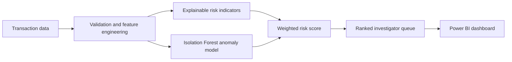

# Financial Crime Analytics

An in-progress portfolio project for turning transaction data into an investigator-ready review queue using SQL, Python, machine learning and Power BI.

> **Project status:** Active development. The repository currently contains a reproducible synthetic-data demo, explainable risk signals, a baseline anomaly model and a Power BI-ready export. It does **not** claim production deployment or validated fraud detection performance.

## What it demonstrates

- Validating and transforming transaction data with Python and pandas
- Creating explainable risk indicators for unusual amounts, rapid movement, cross-border transfers and new counterparties
- Combining rules with an Isolation Forest anomaly score
- Ranking cases for human review rather than automatically declaring transactions fraudulent
- Querying an investigator queue in SQL
- Preparing a flat table and measures for a Power BI dashboard

## Architecture



## Quick start

```bash
python -m venv .venv
source .venv/bin/activate
pip install -r requirements.txt
python -m src.generate_sample
python -m src.pipeline --input data/sample/transactions.csv --output data/sample/investigator_queue.csv
pytest
```

The pipeline creates a ranked review queue with a risk score, risk band and plain-language explanation for every flagged transaction.

## Data

The included sample is deterministic synthetic data generated only for demonstration and testing. It is not IBM data and contains no real people, accounts or financial activity.

The project is designed around a generic AML-style transaction schema and can be adapted to an appropriately licensed dataset. Any future IBM AML data must be obtained under its own terms and is intentionally not redistributed here.

Required columns:

| Column | Meaning |
|---|---|
| `transaction_id` | Unique transaction identifier |
| `account_id` | Originating account |
| `counterparty_id` | Destination counterparty |
| `timestamp` | Transaction time |
| `amount` | Transaction value |
| `country` / `counterparty_country` | Origin and destination countries |
| `transaction_type` | Transfer, cash, card or wire |
| `account_age_days` | Age of originating account |

## Risk indicators

The current baseline flags:

- unusually large amounts relative to the dataset distribution;
- rapid movement (several transactions from one account in 24 hours);
- cross-border transfers;
- transactions involving a new account; and
- statistical anomalies from an Isolation Forest model.

These signals are deliberately visible in `risk_reason`. The output supports review; it is not a substitute for an investigator or a compliant production AML program.

## SQL and Power BI

- [`sql/schema.sql`](sql/schema.sql) creates the transactions and review-queue tables.
- [`sql/investigator_queue.sql`](sql/investigator_queue.sql) returns the highest-risk open cases.
- [`powerbi/README.md`](powerbi/README.md) documents the proposed dashboard pages and DAX measures.

## Roadmap

- Evaluate supervised models on a properly licensed labelled dataset
- Add temporal and network features without target leakage
- Compare thresholds using recall, precision and investigator capacity
- Build and publish the Power BI report
- Add model monitoring and data-quality checks

## Responsible use

An alert means “review this transaction,” not “this customer committed a crime.” Real systems require governance, privacy controls, bias testing, documented thresholds and human oversight.

## License

Code is available under the [MIT License](LICENSE). Generated sample data is for demonstration only.
